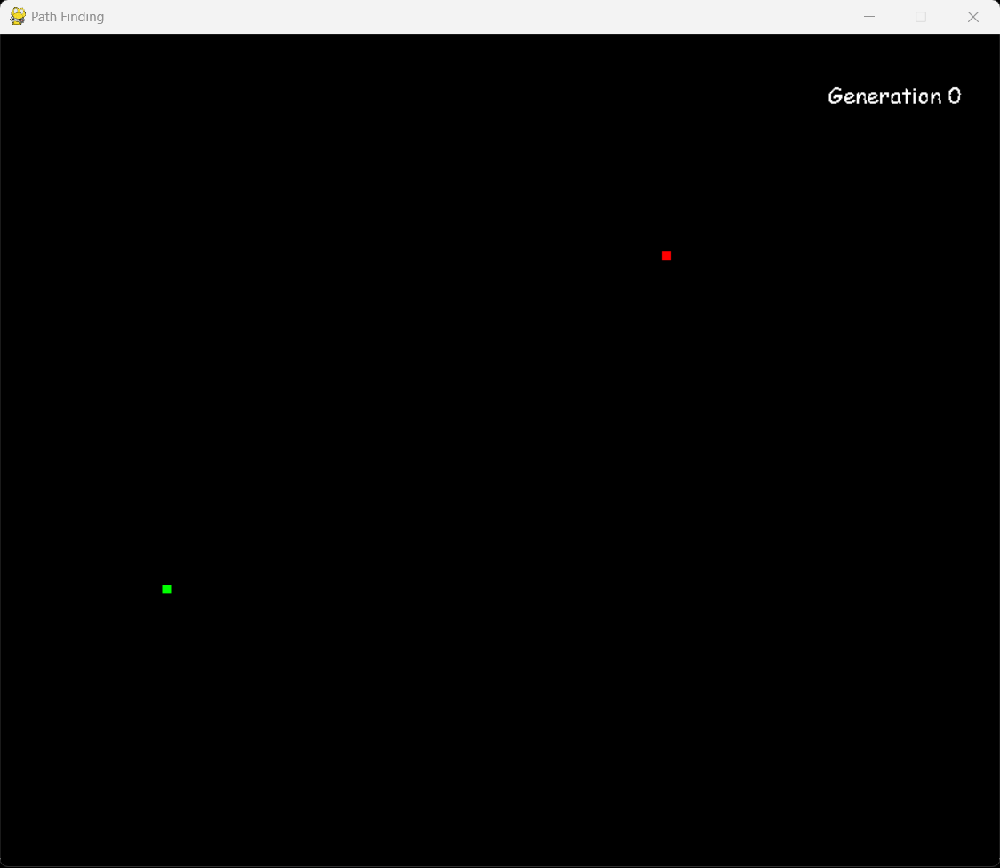
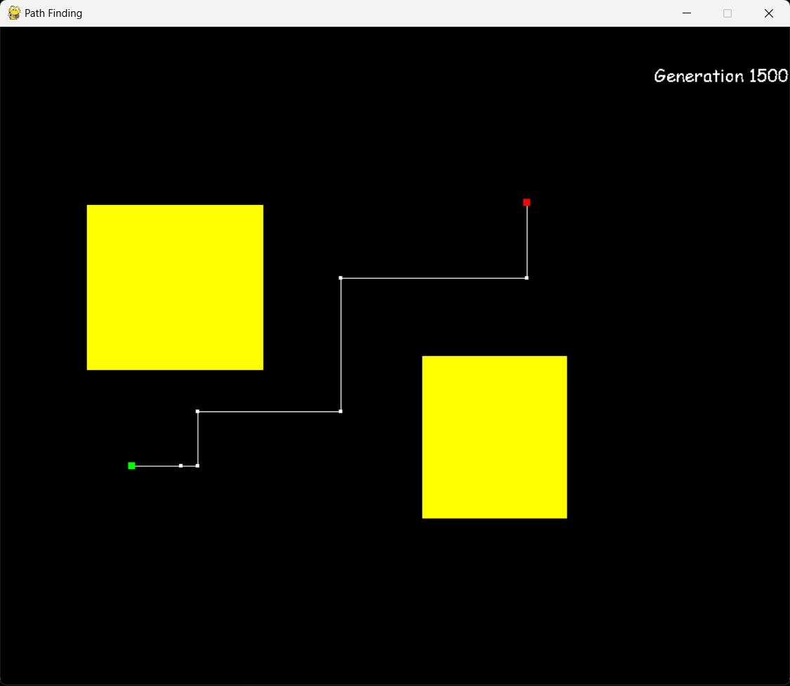
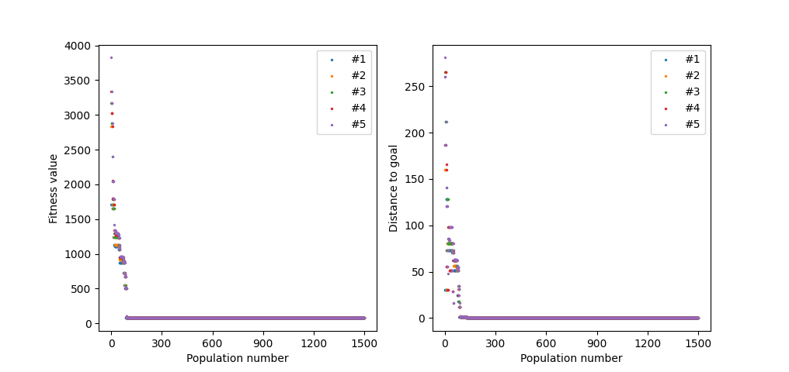

# Genetic Path Finding
 
The app was created in Python with use of PyGame to visualise the process of finding the most optimal path for a mobile robot.

## Table of contents
* [General info](#general-info)
* [Setup](#setup)
* [Launch](#launch)
* [Controls](#controls)
* [Screens](#screens)
* [License](#license)

## General info

The algorithm was created to solve path planning problem for a mobile robot, to be later integrated with ROS and Gazebo simulator. 

Genetic algorithm was chosen, as it is used mainly for global problems and I personally like working with evolutionary algorithms.

Main problems encountered were:
- in complex environments it has tendency to fall into local optima rather than global
- the algorithm requires many iterations and computing power so it is fairly slow
- because it is algorithm depending on stochasticity, it doesn't perform well in "labirynth-like" environments

To eliminate falling into local optimum, in addition to multiple operators such as mutation, crossover or selection, a function was implemented, which in each generation creates random individuals and inserts them into population to promote more diversity.

To further address needs of mobile robots, in the cost function penalty was added to prevent robot from moving too close to obstacles in the form of linear function.

## Setup

You can create new virtual environment

```bash
python -m venv .venv
```

and activate it using command:

- Windows
```bash
.venv\Scripts\activate
```

- other OSes
```bash
source .venv/bin/activate
```

To run the project you need to install required packages, which are included in `requirements.txt` file

```bash
pip install -r requirements.txt
```

## Launch

To launch the project simply type command

```bash
python main.py
```

The command above launches algorithm with default parameters:
- number of generations - 1500
- population size - 150
- max chromosome length (max number of points in the path) - 75

For more precise demands user can add arguments in the command line after path to `main.py` file.

Example:

```bash
python main.py 1000 125 50
```

## Controls

To create the obstacle simply left click (LPM), drag and release your mouse.

To delete the obstacle right click (RPM) on obstacle.

To start the algorithm press SPACE.

To plot current results, such as fitness value or distance to goal, according to generation, press ENTER.

To stop and reset algorithm press SPACE while it is running.

## Screens
<p align="center">
	
  
  
</p>

<p align="center">
	
</p>

## License
This project is licensed under the terms of **the MIT license**.
You can check out the full license [here](./LICENSE)
